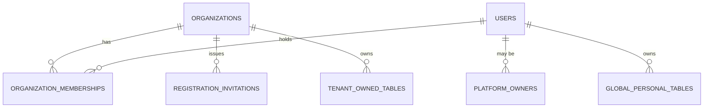

# Architecture and Data Model

Date: 2026-08-05
Scope: `apps/api` (Elixir/Phoenix, hexagonal, bounded contexts), `apps/web` (Next.js 15 App Router)

## 1. High-level architecture

```
Interface     →  Phoenix Controllers, Channels, Plugs, Router pipelines
Application   →  MilosTraining.Application.* (cross-context orchestration)
Domain        →  Pure Elixir business logic (no Ecto, no HTTP, no Redis)
Infrastructure →  Ecto Repos/adapters, MeilisearchClient, Redix, MinIO (ExAws), Oban workers
```

Bounded contexts: `Identity`, `Organizations`, `Scheduling`, `Workouts`, `Execution`,
`Gamification`, `Coaching`, `Notifications`, `Finance`, `Analytics`, `Feedback`,
`Wellbeing`, `Messaging`, `Pantheon`. `mix milos.architecture` enforces the
compile-time boundary rule (verified green during this audit — see
`08-test-gap-plan.md` / commands run).

## 2. Tenancy model as designed (from ADR-055/056/057/058/059/060, ADR-083/087/088)



- **Account (`users`)** — global authentication principal (Identity context). Still
  carries a legacy global `role` enum (`:member | :athlete | :admin`) — see Finding
  F-02 in `04-findings.md`.
- **Organization (`organizations`)** — the tenant root. `slug` globally unique
  (correct — it is the public routing key), `status ∈ {active, suspended, archived}`.
- **Organization membership (`organization_memberships`)** — the *actual*
  authorization surface for tenant-scoped roles: `role ∈ {owner, admin, coach,
  member, athlete}`, `status ∈ {invited, active, suspended, revoked}` (default
  `active`), composite-unique on `(organization_id, user_id)`. **No command exists
  to transition a membership to `suspended`/`revoked`** — see Finding F-08.
- **Platform owner (`platform_owners`)** — separate installation-wide authority,
  keyed by `user_id`, `status ∈ {active, revoked}`. Grant path is exclusively the
  `mix milos.platform.grant_owner` Mix task (no HTTP endpoint). **No revoke code
  path exists** (status enum implies one but none is implemented) — Finding F-09.
- **TenantContext** (`organizations/tenant_context.ex`) — transport-neutral struct
  built by `MilosTraining.Application.ResolveTenantContext` from
  `Organizations.Domain.TenantAuthorization.build/4`, which validates organization
  `status == :active`, membership↔org/user match, and membership `status ==
  :active`. This is the single correct choke point for tenant authorization.
- **Registration invitation (`registration_invitations`)** — opaque 256-bit
  token, SHA-256 digest stored, `organization_id`/`role`/`issued_by_user_id`/
  `expires_at`/`redeemed_at`/`revoked_at`/`intended_email_digest`. One-time-use is
  enforced by `SELECT ... FOR UPDATE` + a state check in the redemption
  transaction, not by a DB constraint independent of the app.

## 3. Authentication flow

```
POST /api/auth/login → AuthController → Guardian issues JWT
  claims: "sv" (security_version), "memberships" (array of org/role snapshots — UI-only, never read back for authz)
Every request → GuardianPlug → resource_from_claims → validate_security_version/2
  (rejects on sv mismatch; legacy tokens with no "sv" claim accepted when user.security_version == 1)
```

Role/membership changes do **not** force session invalidation — only an explicit
`sign_out_all_devices` bumps `security_version`. `UpdateUserRole` broadcasts a
best-effort `"role_changed"` realtime event but does not invalidate tokens. Since
`TenantContext` is rebuilt from live DB state on every request (not from JWT
claims), this is a UI-staleness issue rather than a live authorization bypass —
see Finding F-11 (Low).

## 4. Authorization/tenant-resolution flow (as implemented — diverges from ADR-058)

```
HTTP request
  → Guardian auth (:authenticated pipeline)
  → ResolveTenantContext plug:
       slug = path_params["organization_slug"]
              || request header "x-organization-slug"
              || legacy_organization_slug()          <-- ADR-058 violation + legacy default
  → TenantAuthorization.build(account, slug, ...)     <-- DB membership re-validated here
  → RequireTenantRole (role ∈ allowed list)           <-- for admin_only/tenant_member/etc.
  → Controller → Application Service → Context public API (Commands/Queries)
  → Ecto adapter (RepoContext.run/2 sets `app.organization_id`/`app.user_id`
       transaction-local Postgres settings) → RLS-enforced tables
```

Two structurally different route families exist concurrently:
- **New, slug-scoped**: `scope "/api/org/:organization_slug/..."` (router.ex
  ~105–133) — path segment supplies the slug, no header/legacy fallback reached.
- **Legacy, non-slugged**: `scope "/api/admin", ...` (router.ex 166–320, ~140
  routes — the majority of admin functionality: users, workouts, finance,
  schedule, challenges, wellbeing, settings) — `organization_slug` path param is
  always absent, so **every one of these ~140 endpoints resolves its tenant from
  the `x-organization-slug` header or, absent that, the hardcoded legacy
  organization**. See Finding F-01 (Critical/High) in `04-findings.md`.

A third pipeline, `:user_only`, assigns no tenant context at all
(`AssignUserContext` only) and is used for personal/global-personal resources
(journal, PRs, notifications, wellbeing, **and** `POST /api/executions`). One
execution-start code path (`Execution.Commands.StartExecution.call/2`) reads
`organization_id` directly from client-supplied params with no membership check
for the `self_selected`/`class_booking` sources — Finding F-03.

## 5. Tenant propagation beyond PostgreSQL

Per ADR-059, every Oban job argument/uniqueness key, PubSub/Channel topic, Redis
key, Meilisearch filter, and MinIO object prefix is supposed to carry
`organization_id` or `owner_user_id`. Verified during this audit:
- Realtime broadcast helpers (`realtime.ex`, `application/schedule_realtime.ex`)
  fall back to the **legacy organization ID** when a payload omits
  `organization_id`, rather than raising — Finding F-04.
- `EctoFinanceStore.get_finance_settings/0` / `update_finance_settings/1` issue
  `Repo.one(from s in FinanceSetting, limit: 1)` with **no explicit
  `organization_id` predicate at all**, relying entirely on RLS (which itself has
  the legacy-org COALESCE fallback — Finding F-05) to scope the row.
- Frontend REST client and WebSocket client resolve "current organization"
  through **two independent, disagreeing fallback chains** (localStorage vs. JWT
  first-membership) — Finding F-12.

## 6. Row-Level Security enforcement state (verified against the running dev DB)

`mix milos.tenancy.audit` was executed against a locally migrated copy of the
schema (dev/test infra started for this audit only — see `08-test-gap-plan.md`
for exact commands run). All 44 tables in the module's `@ready_tenant_tables` /
`@ready_personal_tables` lists report `unmapped=0 rls=true force=true`, and the
task's `ready_for_full_enforcement?/1` gate passes (`@transitional_tenant_tables`
is now empty). This substantiates the TD-038 "complete" claim **for the specific
table list the audit script checks**.

However, the audit script has blind spots, verified by direct migration review:
- Every "enforce"-stage RLS policy across finance, memberships, promotions,
  referrals, messaging, gamification, analytics, feedback/reviews, and
  attendance tables uses `organization_id = COALESCE(NULLIF(current_setting(
  'app.organization_id', true), ''), milos_legacy_organization_id())` — i.e. RLS
  itself silently scopes any session that never sets `app.organization_id` to
  the **legacy organization**, rather than denying all rows. `mix
  milos.tenancy.audit`'s `rls_forced` check is `true` for these tables
  regardless of this fallback — the script cannot detect it. Finding F-05
  (Critical).
- Materialized views (`finance_aggregates`, `coaching_aggregates`,
  `weekly_leaderboard`) are tenant-owned per
  `docs/architecture/tenant-ownership-inventory.md` but are **not present in
  either `@ready_tenant_tables` or `@ready_personal_tables`** — the audit script
  does not check their RLS/grouping status at all.

See `02-tenant-surface-matrix.md` for the full per-table/per-surface matrix and
`04-findings.md` for full evidence and severity.

## 7. Key entities and relationships (tenant-owned vs global-personal vs platform-global)

See `docs/architecture/tenant-ownership-inventory.md` (pre-existing, read and
verified as still accurate against migrations during this audit) for the
authoritative classification table. This audit did not find any table whose
actual migration-time classification contradicts that inventory, except for the
RLS-fallback nuance in §6.
